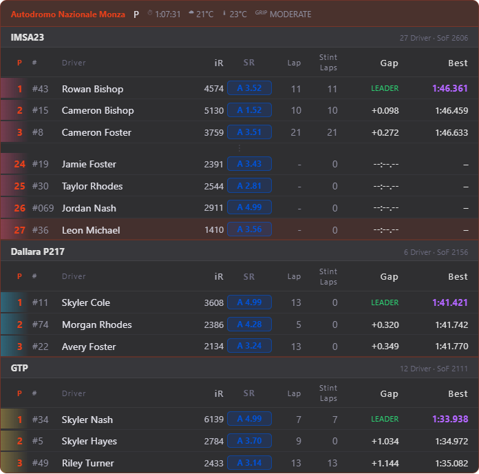
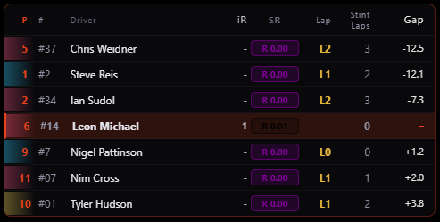
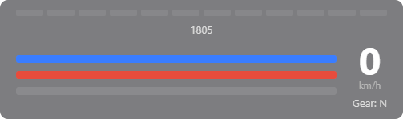
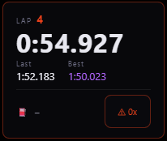
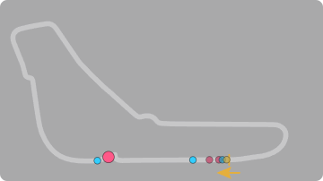
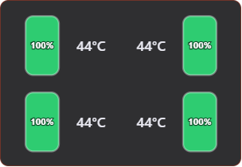
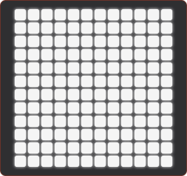

# YAiRO — Yet Another iRacing Overlay

Simple, lightweight overlays for iRacing.
All overlays are also available to use in a browser or as an OBS browser source.

No cloud, everything free, everything open-source.

## Features

### 🥇 Standings

- Session info
- Multi-Class support
- Choose top cars to be displayed
- Choose cars around you to be displayed
- Car info:
  - Class-position
  - Number
  - Name
  - iRating and Safety Rating (can also be hidden)
  - Lap of cars
  - [Stint laps¹](#-stint-laps)
  - Gap to leader
  - Best lap

### ↔️ Relative

- Multi-Class support
- Choose cars around you to be displayed
- Car info:
  - Class-position
  - Number
  - Name
  - iRating and Safety Rating (can also be hidden)
  - Lap of cars
  - [Stint laps¹](#-stint-laps)
  - Gap to you

### 📊 Telemetry

- Rev bar
- RPM as number (can also be hidden)
- Input bars for clutch, brake and throttle
- Speed
- Gear

### ⛽ Fuel
TODO document

### ⏱️ Lap Timer

- Current lap
- Current lap time
- Last lap time
- Best lap time
- Estimated Laps
- Incidents

### ❌ Incidents
TODO document

### 🗺️ Trackmap

- Multi-Class support
- Cars on track
- Cars in pit
- Start/Finish line
- Track direction

### 🛞 Tires

- Tire wear
  - as graphic and number (can be hidden)
- Tire temperature

### 🏁 Flags

- Flags:
  - Black flag
  - Meatball flag
  - Red flag
  - Checkered flag
  - Blue flag
  - Yellow flag
  - Red-Yellow (caution) flag
  - White flag
  - Green flag

### 🎨 Custom accent color
TODO document

## Notes

### ⚠️ Stint Laps
iRacing does not provide this info. It is calculated internally from tracked laps.
But when the program is not running (e.g. in 24hr races when you turn off your pc) and in the meantime the car pits,
it is not tracked and the stint laps will continue to rise when you reconnect and start YAiRO.

## Planned features

- **More Overlays** - Weather, Flags, Radar (as far as possible), Delta bar, ...
- **More Games** - Assetto Corsa Games, Le Mans Ultimate, ...
- **Broadcast Overlays** - Overlays more focused on design to use in livestreams
- **Customizability** - Choose colors, fonts, reorder columns, ...

## Requirements

- Windows
- [iRacing](https://www.iracing.com)
- For Development: Node.js 18+

## Development and Build (WIP)

```bash
npm install
npm run dev
```

Build `.exe`:

```bash
npm run build:win
```
