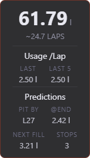
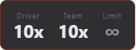
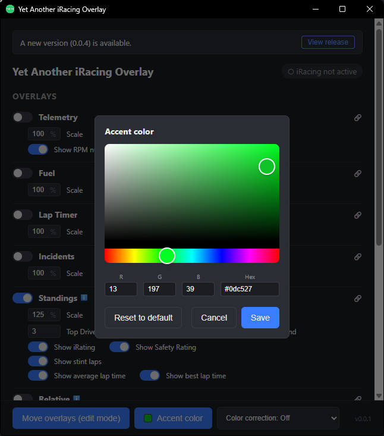

# YAiRO — Yet Another iRacing Overlay

Simple, lightweight overlays for iRacing.
All overlays are also available to use in a browser or as an OBS browser source.

No cloud, everything free, everything open-source.

## Features

### 🥇 Standings


- Session info
- Multi-Class support
- Choose top cars to be displayed
- Choose cars around you to be displayed
- Car info:
  - Class-position
  - Number
  - Name
  - iRating and Safety Rating (can also be hidden)
  - Lap of cars
  - [Stint laps¹](#-stint-laps)
  - Gap to leader
  - Average lap time
  - Best lap time

### ↔️ Relative


- Multi-Class support
- Choose cars around you to be displayed
- Car info:
  - Class-position
  - Number
  - Name
  - iRating and Safety Rating (can also be hidden)
  - Lap of cars
  - [Stint laps¹](#-stint-laps)
  - Gap to you
  - Average lap time

### 📊 Telemetry


- Rev bar
- RPM as number (can also be hidden)
- Input bars for clutch, brake and throttle
- Speed
- Gear

### ⛽ Fuel


- Current fuel
- Estimated laps remaining
- Fuel consumption per lap
  - Last lap
  - Average last 5 laps
- Predictions
  - Lap to pit
  - Fuel left at pitting
  - Fuel to fill
  - Stops until end of race

### ⏱️ Lap Timer


- Current lap
- Current lap time
- Delta to best lap or target lap (if set)
- Last lap time
- Best lap time
- Target lap time (only if set)

### ❌ Incidents


- Incidents of current driver
- Team incidents
- Incident limit (next penalty at X incidents)

### 🗺️ Trackmap


- Multi-Class support
- Cars on track
- Cars in pit
- Start/Finish line
- Track direction

### 🛞 Tires


- Tire wear
  - as graphic and number (can be hidden)
- Tire temperature

The data is only updated when you are pitting.
Therefore, the overlay is only visible in the pit lane.

### 🏁 Flags


- Flags:
  - Black flag
  - Meatball flag
  - Red flag
  - Checkered flag
  - Blue flag
  - Yellow flag
  - Red-Yellow (caution) flag
  - White flag
  - Green flag

### 🎨 Custom accent color


- Choose color by
  - picker
  - hex value
  - RGB value
- Reset to default orange

### 🔓 Accessibility

#### **Color correction filter**

- Available filter:
  - Protanopia
  - Deuteranopia
  - Tritanopia
- Affects control center and overlay-windows, using the URL (e.g. in OBS) does not apply the filter!

As I'm not colorblind and I don't know a colorblind person, I can't test this feature properly and relly on feedback. I would appreciate any feedback on this feature!

## Notes

### ⚠️ Stint Laps
iRacing does not provide this info. It is calculated internally from tracked laps.
But when the program is not running (e.g. in 24hr races when you turn off your pc) and in the meantime the car pits,
it is not tracked and the stint laps will continue to rise when you reconnect and start YAiRO.

## Planned features

- **More Overlays** - Weather, Flags, Radar (as far as possible), Delta bar, ...
- **More Games** - Assetto Corsa Games, Le Mans Ultimate, ...
- **Broadcast Overlays** - Overlays more focused on design to use in livestreams
- **Customizability** - Choose colors, fonts, reorder columns, ...

## Requirements

- Windows
- [iRacing](https://www.iracing.com)
- For Development: Node.js 18+

## Development and Build (WIP)

```bash
npm install
npm run dev
```

Build `.exe`:

```bash
npm run build:win
```
